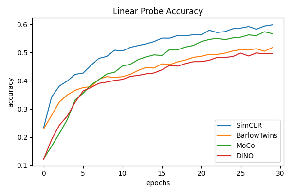
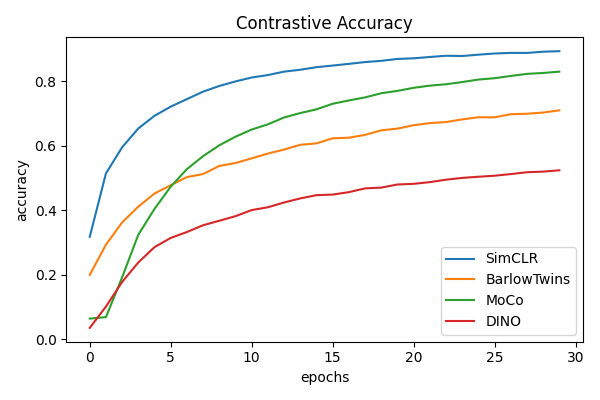

# Self-supervised Contrastive Learning for Image Classification with Keras

This repository contains an implementation for 8 self-supervised instance-level (image-level) representation learning methods:
- Contrastive:
    - [MoCo](https://arxiv.org/abs/1911.05722) ([v2](https://arxiv.org/abs/2003.04297), [v3](https://arxiv.org/abs/2104.02057))
    - [SimCLR](https://arxiv.org/abs/2002.05709)
    - [NNCLR](https://arxiv.org/abs/2104.14548)
    - [Decoupled Contrastive Learning](https://arxiv.org/abs/2110.06848) (named DCCLR in this repository)
- Redundancy-reducing:
    - [BarlowTwins](https://arxiv.org/abs/2103.03230)
    - [Hilbert-Schmidt Independence Criterion Maximization](https://arxiv.org/abs/2104.13712) (named HSICTwins in this repository)
- Negative-free:
    - [DINO](https://arxiv.org/abs/2104.14294)
    - [TWIST](https://arxiv.org/abs/2110.07402)

Try it out in a Colab Notebook (one training takes 40-60 minutes): 

The codebase follows modern Tensorflow2 + Keras best practices and the implementation seeks to be as concise and readable as possible. This implementation is intended to be used as an easy-to-use baseline instead of as a line-by-line reproduction of the papers.

The image augmentation pipeline is a crucial component of all these methods. You can find implementations of other custom Keras image augmentation layers in [this repository](https://github.com/beresandras/image-augmentation-layers-keras).

## Design choices:
- simple and easy-to-read implementation over accuracy to the finest implementation details
- simple feedforward convolutional architecture: 
    - the methods have to be robust enough to work on simple architectures as well
    - this enables the usage of larger batch sizes
    - the shorter training time enables more thorough hyperparameter tuning so that the comparison is fairer
- no batchnorm layers used for benchmarking: as reported in [CPCv2](https://arxiv.org/abs/1905.09272) and [MoCo](https://arxiv.org/abs/1911.05722), it introduces an intra-batch dependency between samples, which can hurt performance
- only the most important image augmentations are used, to avoid having too much hyperparameters:
    - random resized crop: forces the model to encode different parts of the same image similarly
    - random color jitter: prevents a trivial color histogram-based solution to the task by distorting color histograms
    - random horizontal flip: introduces the prior that the horizontal directions are more interchangeable than the vertical ones
- dataset: [STL10](https://ai.stanford.edu/~acoates/stl10/), a semi-supervised dataset with 100.000 unlabeled + 5000 labeled images, well suited for self-supervised learning experiments

## Results

